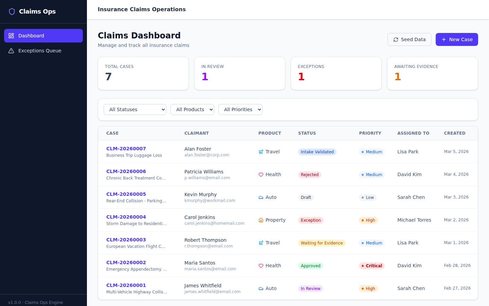
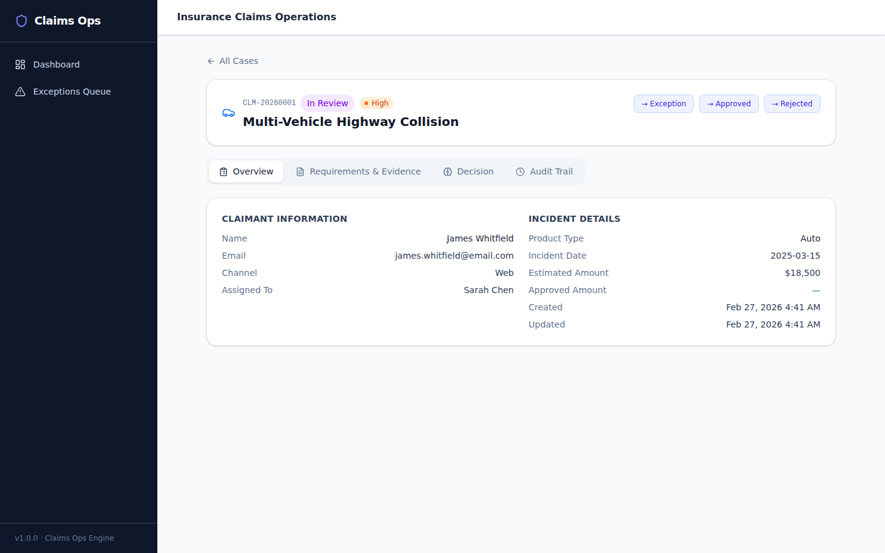
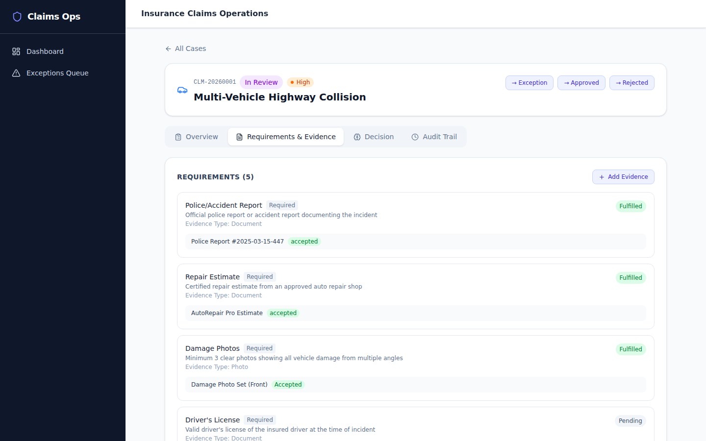
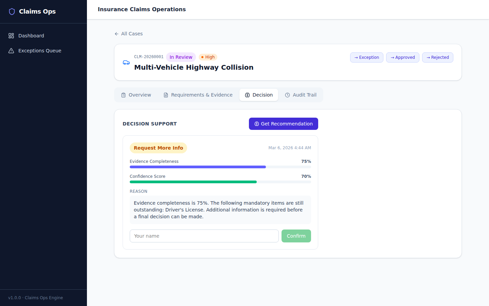
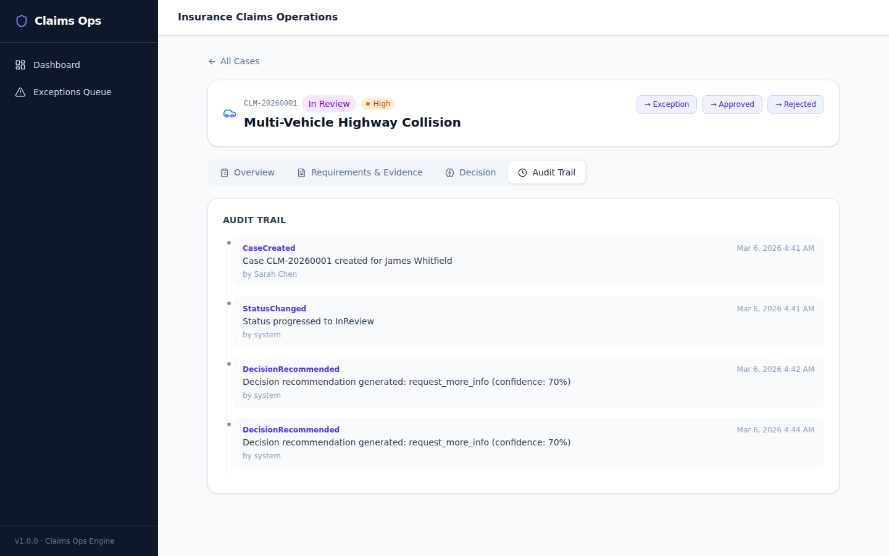
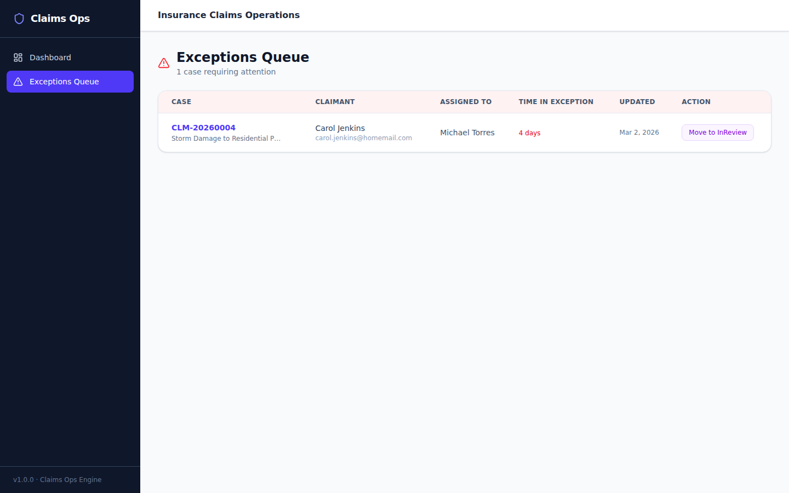
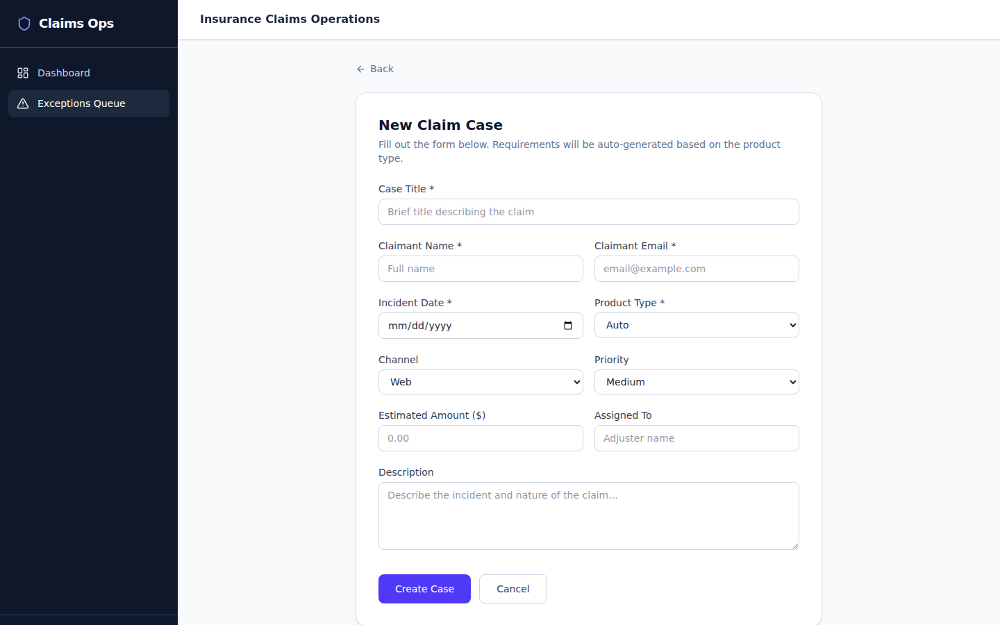

# Claims Ops Engine

> 保険金請求・査定オペレーション管理プラットフォーム  
> Insurance Claims Operations Management Platform

---

## Why（なぜ必要か）

保険金請求の現場では、事故受付から支払判断までの間に、必要書類の案内・損害情報の整理・補足照会・支払根拠の説明・異議対応が **分断されたまま** 存在します。

その結果、コールセンター・査定担当・BPO チームに重いオペレーション負荷がかかり続けています。既存のシステム（ERP・CLM・EHR）が導入されていても、**判断待ちの滞留・例外処理の属人化・監査証跡の分散** といった問題は解消されません。

Claims Ops Engine は、この「システム間の高摩擦部分」を一元管理するケース運用基盤です。

---

## Problem（課題）

| 課題 | 影響 |
|------|------|
| 案件の進捗状況が分散・不透明 | 担当者間の引き継ぎに時間がかかる |
| 必要書類の案内が属人的 | 差し戻し・再提出が頻発する |
| 例外案件の優先度が曖昧 | 高額・高リスク案件が埋もれる |
| 判断根拠が記録されない | 監査・再審査時に根拠が追えない |
| 証拠の完全性を手動で確認 | 査定前に必要な書類が揃っていない |

---

## Solution（解決方法）

Claims Ops Engine は以下を提供します：

1. **ケースボード（Case Board）** — 全案件を一覧表示。ステータス・商品種別・優先度でフィルタリング可能
2. **要件エンジン（Requirement Engine）** — 商品種別（自動車・医療・旅行・財産）に応じた必要書類を自動算出
3. **証拠管理（Evidence Management）** — 提出書類の受理・承認・却下と充足率の可視化
4. **判断支援（Decision Support）** — 証拠充足率に基づくルールベースの推奨判断（承認 / 情報追加要求 / エスカレーション / 却下）
5. **例外キュー（Exception Queue）** — 例外案件の専用ビューで優先度付き対応
6. **監査証跡（Audit Trail）** — すべての操作を時系列で記録・再現可能

---

## How to Use（使い方）

### 必要環境

- Python 3.11+
- Node.js 18+
- npm 9+

### 起動方法

#### 1. バックエンドの起動

```bash
cd backend
pip install -r requirements.txt
uvicorn app.main:app --reload
```

API サーバーが `http://localhost:8000` で起動します。  
Swagger UI: `http://localhost:8000/docs`

#### 2. フロントエンドの起動

```bash
cd frontend
npm install
npm run dev
```

UI が `http://localhost:5173` で起動します。

#### 3. サンプルデータの投入（初回のみ）

```bash
curl -X POST http://localhost:8000/api/seed
```

または、ダッシュボード右上の「**Seed Data**」ボタンをクリックしてください。  
7 件のサンプル案件が投入されます。

---

### 基本操作

| 操作 | 方法 |
|------|------|
| 案件一覧を確認 | Dashboard（サイドバー） |
| 案件を絞り込む | Status / Product / Priority フィルター |
| 新規案件を作成 | 右上の「New Case」ボタン |
| 案件詳細を確認 | 一覧のケース番号をクリック |
| ステータスを更新 | 案件詳細ページのステータスボタン |
| 証拠書類を追加 | Requirements & Evidence タブ → Add Evidence |
| 判断推奨を取得 | Decision タブ → Get Recommendation |
| 操作履歴を確認 | Audit Trail タブ |
| 例外案件を管理 | サイドバー「Exceptions Queue」 |

---

### ワークフロー

```
新規案件作成（Draft）
    ↓
受付確認（IntakeValidated）
    ↓
証拠収集（WaitingForEvidence）
    ↓
査定中（InReview）
    ↓
例外あり → 例外対応（Exception）
    ↓
承認（Approved）または却下（Rejected）
    ↓
クローズ（Closed）
    ↓
再審査が必要な場合 → 再開（Reopened）
```

---

## Screenshots

### ダッシュボード — 全案件一覧



ステータス別の件数サマリー、フィルタリング機能付きの案件テーブル。

---

### 案件詳細 — 概要タブ



契約者情報・事故詳細・ステータス遷移ボタン。

---

### 案件詳細 — 要件・証拠タブ



商品種別に応じた必要書類チェックリストと提出証拠の管理。

---

### 案件詳細 — 判断支援タブ



証拠充足率に基づくルールベース推奨判断と不足情報の提示。

---

### 案件詳細 — 監査証跡タブ



全操作の時系列ログ。監査・再現性確保のため変更不可。

---

### 例外キュー



標準フローから外れた案件の専用管理画面。

---

### 新規案件作成



---

## アーキテクチャ

```
claims-ops-engine/
├── backend/                  # Python FastAPI + SQLite
│   ├── app/
│   │   ├── main.py           # FastAPI エントリーポイント
│   │   ├── models.py         # SQLAlchemy モデル
│   │   ├── schemas.py        # Pydantic スキーマ
│   │   ├── database.py       # DB接続設定
│   │   ├── routers/
│   │   │   ├── cases.py      # ケース管理 API
│   │   │   ├── evidence.py   # 証拠管理 API
│   │   │   ├── decisions.py  # 判断支援 API
│   │   │   └── audit.py      # 監査証跡 API
│   │   └── services/
│   │       ├── requirement_engine.py  # 必要書類の自動算出
│   │       └── decision_support.py   # ルールベース判断支援
│   └── requirements.txt
├── frontend/                 # React + TypeScript + Vite + Tailwind CSS
│   └── src/
│       ├── pages/
│       │   ├── Dashboard.tsx     # ケースボード
│       │   ├── CaseDetail.tsx    # 案件詳細（4タブ）
│       │   ├── CreateCase.tsx    # 新規案件作成フォーム
│       │   └── ExceptionsQueue.tsx
│       ├── types/            # TypeScript 型定義
│       └── lib/api.ts        # API クライアント
└── docs/                     # 仕様書・設計ドキュメント
```

---

## API リファレンス

起動後、`http://localhost:8000/docs` で Swagger UI にアクセスできます。

| エンドポイント | メソッド | 説明 |
|---|---|---|
| `/api/cases` | GET | 案件一覧（フィルタ付き） |
| `/api/cases` | POST | 案件作成 |
| `/api/cases/{id}` | GET | 案件詳細 |
| `/api/cases/{id}/status` | PATCH | ステータス更新 |
| `/api/cases/{id}/evidence` | GET/POST | 証拠管理 |
| `/api/cases/{id}/decisions/recommend` | POST | 判断推奨の生成 |
| `/api/cases/{id}/decisions/{did}/confirm` | POST | 判断の確定 |
| `/api/cases/{id}/audit` | GET | 監査証跡 |
| `/api/seed` | POST | サンプルデータ投入 |

---

## プロダクト KPI

本プラットフォームは以下の業務指標の改善を目的として設計されています：

- **Intake to Decision Lead Time** — 受付から判断までのリードタイム
- **Evidence Completeness Score** — 証拠充足率
- **Exception Aging** — 例外案件の滞留時間
- **Rework Ratio** — 差し戻し率
- **Decision Explainability Coverage** — 判断根拠の説明可能率

---

## 技術スタック

| レイヤー | 技術 |
|---|---|
| Backend | Python 3.11 / FastAPI / SQLAlchemy / SQLite |
| Frontend | React 18 / TypeScript / Vite / Tailwind CSS |
| HTTP Client | Axios / TanStack Query |
| UI Icons | Lucide React |
